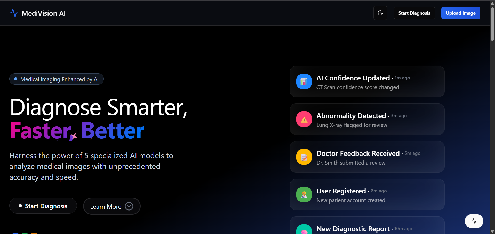
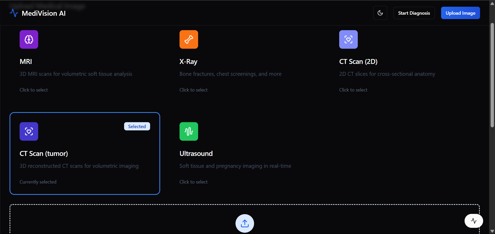
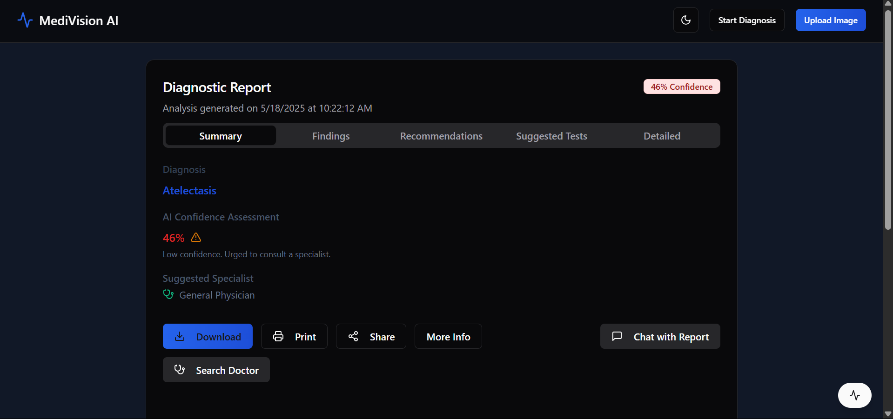

# 🩺 MediVision AI - Medical Assistant AI Platform

## 📸 Overview

An intelligent diagnostic assistant for analyzing medical images (X-rays, CT scans, MRIs, and ultrasounds), generating detailed reports, and offering follow-up actions such as doctor search and chat-based explanations.

---

## 🚀 Tech Stack

| Area         | Tech Used                                                                     |
| ------------ | ----------------------------------------------------------------------------- |
| Frontend     | Vite ⚡, React 🧩, TailwindCSS 🎨, Leaflet 🗺️, ShadCN-UI 🧱, PDF generator 📄 |
| Backend      | FastAPI 🚀, PyTorch 🔥, Pydicom 🧬, OpenCV 🖼️, Gemini Pro AI ✨               |
| ML Models    | Pretrained vision models via `timm`, Torch models                             |
| Auth & Utils | Clerk 🔐, FastAPI Users ⚙️, Geopy for location-based doctor search            |

---

## 📂 Folder Structure

```
Medical-Assistant-1/
├── frontend/          # React + Vite + Tailwind UI
├── backend/           # FastAPI + Torch inference
│   ├── main.py        # All backend routes
│   └── services/      # Contains model processing scripts
├── requirements.txt   # Backend dependencies
└── package.json       # Frontend dependencies
```

---

## 🧠 Key Features

* 🩻 **Medical Image Upload**: Supports X-ray, CT (2D & 3D), MRI, and Ultrasound.
* 📊 **Detailed AI Report Generation**: Uses LLM to generate PDF-style medical reports.
* 🔎 **Real-time Doctor Search**: Location-aware map and appointment integration.
* 🤖 **Chat with Report**: Query the report using Gemini AI.
* 📄 **PDF Download**: Export the generated report with branding & watermark.

---

## 🔗 Backend API Routes

### 📁 Image Upload and Prediction

#### `POST /predict/xray/`

Upload an X-ray image to get disease predictions.

#### `GET /get_latest_results/`

Returns the most recent X-ray prediction output.

### 🧾 Report Generation

#### `POST /generate-report/{modality}/`

Supports `xray`, `ct`, `ultrasound`, `mri`. Returns AI-generated diagnosis report.

#### `GET /get-latest-report/{modality}/`

Get the last generated report for a given modality.

---

### 🧠 CT Scan Support

#### `POST /predict/ct/2d/`

Upload 2D CT slices and get prediction + report.

#### `GET /predict/ct/2d/`

Returns the latest CT 2D report.

#### `POST /predict/ct/3d/`

Upload 3D NIfTI CT scan for volumetric analysis.

#### `GET /predict/ct/3d/`

Returns the latest CT 3D report.

---

### 🧠 MRI Scan Support

#### `POST /predict/mri/3d/`

Upload 3D MRI file to analyze and extract findings.

#### `GET /predict/mri/3d/`

Returns the most recent MRI 3D report.

---

### 🧠 Ultrasound Support

#### `POST /predict/ultrasound/`

Ultrasound image upload + diagnostic summary.

---

### 💬 Chat-based Report Interpretation

#### `POST /chat_with_report/`

Send a question related to the report and get AI-powered insights using Gemini Pro.

---

## 🛠️ Installation

### 📦 Backend

```bash
cd backend
pip install -r requirements.txt
uvicorn main:app --reload
```

### ⚛️ Frontend

```bash
cd frontend
npm install
npm run dev
```

---

## 🧪 Dependencies

### 📄 `requirements.txt`

* `fastapi`, `uvicorn`, `torch`, `torchvision`
* `pydicom`, `opencv-python`, `scikit-learn`
* `numpy`, `pillow`, `pydantic`, `timm`
* `fastapi-users`, `geopy`, `dotenv`, etc.

### 📄 `package.json`

* React, Vite, Tailwind, Framer Motion
* Leaflet (map view), @react-pdf/renderer (PDF generation)
* ShadCN UI (Radix based UI components)
* Routing via `react-router-dom`

---

## 📸 UI Preview

- Landing Page

- File Upload

- Results Page


---

## ✍️ Authors

* **Sumit Singh** (Model Training + Backend Development)
* **Somil Gupta** (Frontend + Backend Integrations)
* **Abhishek** (Prompt Designing + chatbot)

---

## 📜 License

MIT License © 2025

---

## 💡 Ideas for Future Work

* Real-time WebSocket updates for predictions
* Patient medical history & storage
* Admin dashboard for logs, analytics, and moderation
* Google Calendar integration for booking
* Multi-language report generation

---

## 🤝 Contributing

1. Fork the repo
2. Create your branch (`git checkout -b feature/xyz`)
3. Commit your changes (`git commit -am 'Add xyz'`)
4. Push to the branch (`git push origin feature/xyz`)
5. Open a Pull Request 🚀

---

🧱 Design and Developed by Team **CodeGenius**  ⚙️

<!-- ## 🧭 Project Status

> Alpha 🚧 – Core features implemented, refining UI/UX & robustness underway. -->
